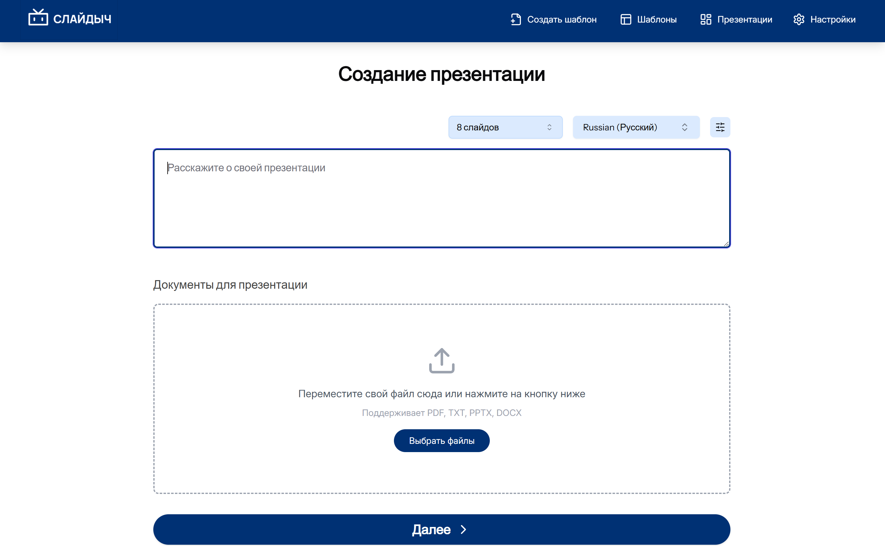
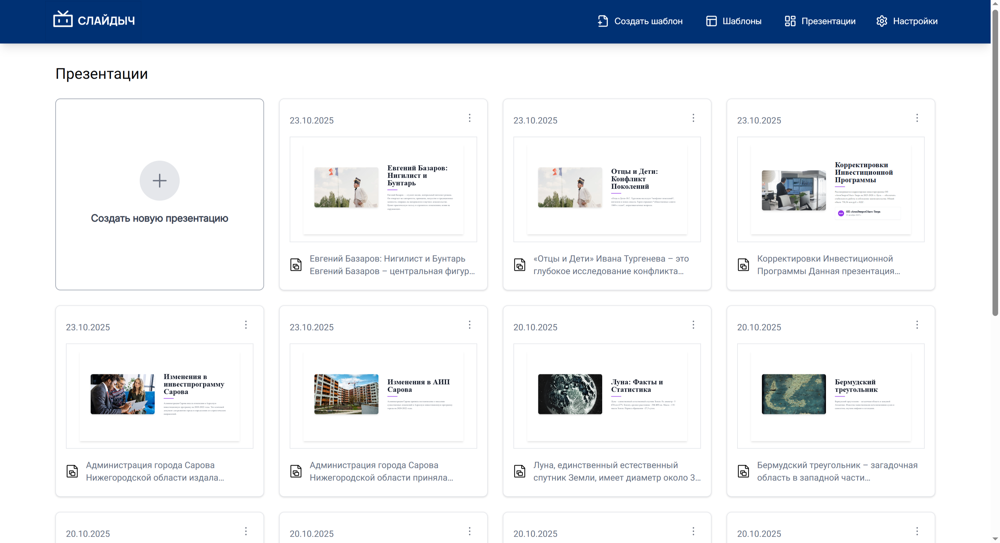
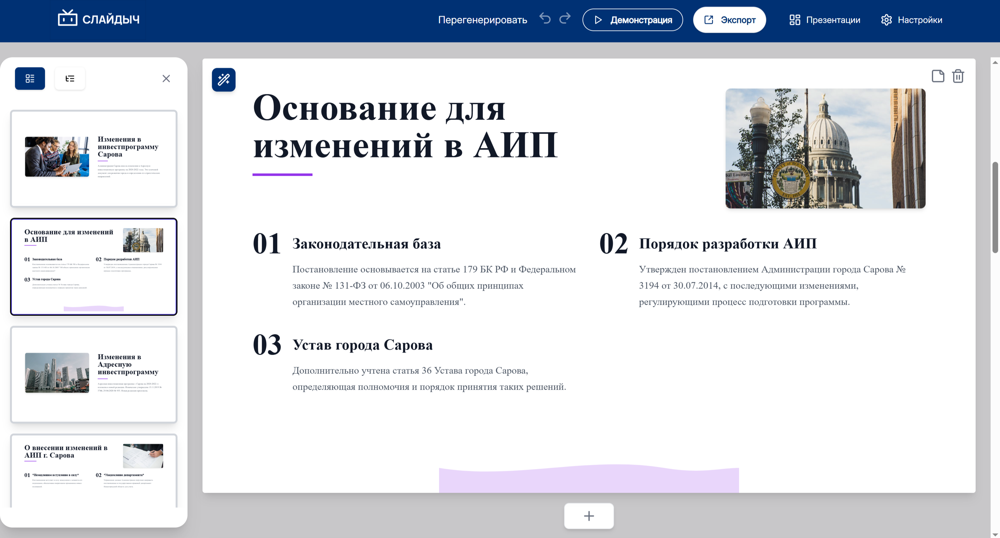
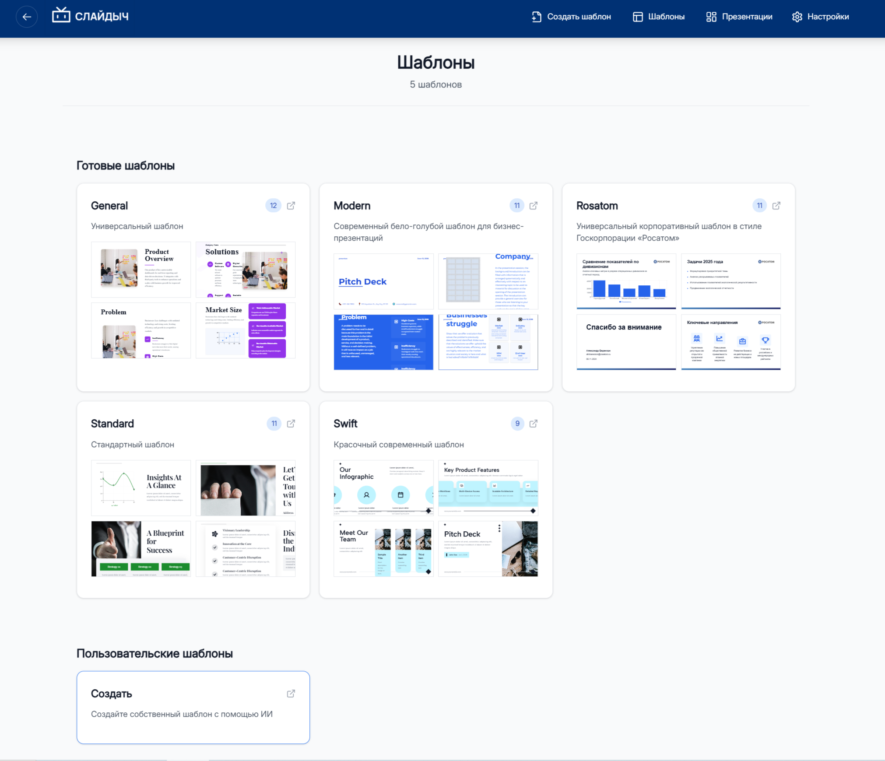

<p align="center">
  
</p>

# Open-Source AI-ассистент для создания презентаций

**Слайдыч** — это умный веб-сервис, который автоматизирует процесс создания презентаций. 
Он позволяет генерировать презентаций на основе пользовательского описания и загруженных документов (PDF, PPTX, TXT, DOCX) - локально на вашем устройстве.  

#### Проект основан на [Presenton](https://github.com/presenton/presenton)  
###  **Доработки и улучшения**

✅ **Новый Image Provider** - добавлена поддержка генерации изображений с помощью Kandinsky  
✅ **RAG-система** - благодаря добавлению Retrieval-Augmented Generation появилась возможность обрабатывать даже объемные документы  
✅ **Улучшенная обработка документов** - парсинг документов оптимизирован и ускорен  
✅ **Локализация** - интерфейс сервиса полностью переведен на русский язык  
✅ **Генерация шаблонов с GOOGLE** - добавлена поддержка моделей GOOGLE для генерации шаблонов  
✅ **Новый шаблон** - добавлен шаблон в стиле корпорации "Росатом"

<center>
    <div></div>
    <div></div>
    <div></div>
    <div></div>
</center>


## Основные возможности

*   **Поддержка нескольких LLM-провайдеров:** Интеграция с локальными моделями через Ollama и любыми OpenAI-совместимыми API (Gemini, GPT, Claude), (в демо используется Deepseek).
*   **Генерация и подбор изображений:** Поддержка Kandinsky, DALL-E 3, Gemini, а также стоковых сервисов Pexels и Pixabay. Возможность загрузки собственных изображений.
*   **Глубокий анализ документов:** Система использует RAG (Retrieval-Augmented Generation) (langchain)для анализа контента из файлов `.docx`, `.pptx`, `.pdf`, и `.txt`, обеспечивая релевантность генерируемых слайдов.
*   **Создание пользовательских шаблонов:** Загрузите ваш `.pptx` или `.pdf` файл, и Слайдыч автоматически преобразует его в редактируемый шаблон, который можно использовать для генерации новых презентаций.
*   **Интерактивный редактор слайдов:** Редактируйте текст, заменяйте изображения и иконки, меняйте слайды местами прямо в веб-интерфейсе после генерации.
*   **Экспорт в PPTX и PDF:** Скачивайте готовую презентацию в популярных форматах для дальнейшего использования.


---

## Quick Start

Для запуска проекта на вашем локальном компьютере выполните следующие шаги:

1. **Создайте и настройте файл конфигурации:**
    Скопируйте файл `.env.example` в новый файл `.env` и укажите в нем необходимые ключи API и настройки.
    ```bash
    cp .env.example .env
    ```
    Подробнее о настройке читайте в разделе [Конфигурация](#конфигурация).

<p>&nbsp;</p>

2. **Запустите проект с помощью Docker Compose:**
    ```bash
    docker compose up --build
    ```

После успешного запуска веб-интерфейс будет доступен по адресу `http://localhost:5050`.


---


## Конфигурация

Все настройки проекта производятся в файле `.env`.

### 1. Настройка LLM

Укажите, какого провайдера и модель вы хотите использовать для генерации текста.

**Пример для Ollama:**
1. Скачайте модель через Ollama
2. Укажите Ollama URL
```env
LLM="ollama"
OLLAMA_URL="http://host.docker.internal:11434" 
OLLAMA_MODEL="llama3:8b"
```

**Пример для стороннего OpenAI-совместимого API:**
```env
LLM="custom"
CUSTOM_LLM_URL="https://api.example.com/v1"
CUSTOM_LLM_API_KEY="your-api-key"
CUSTOM_MODEL="model-name"
```

### 2. Настройка генерации изображений

Выберите провайдера для генерации или подбора изображений и укажите соответствующий ключ API.

**Пример для Kandinsky:**
```env
IMAGE_PROVIDER="Kandinsky"
KANDINSKY_API_KEY="your-kandinsky-api-key"
```

**Пример для Pexels (стоковые фото):**
```env
IMAGE_PROVIDER="pexels"
PEXELS_API_KEY="your-pexels-api-key"
```

**Pixabay**
```env
IMAGE_PROVIDER="pixabay"
PIXABAY_API_KEY="your-pixabay-api-key"
```

### 3. Хранение данных

По умолчанию все данные (база данных, загруженные файлы, сгенерированные презентации) хранятся в директории `app_data` в корне проекта. Вы можете изменить этот путь, указав его в переменной `APP_DATA_DIRECTORY`.

```env
APP_DATA_DIRECTORY=./app_data
```