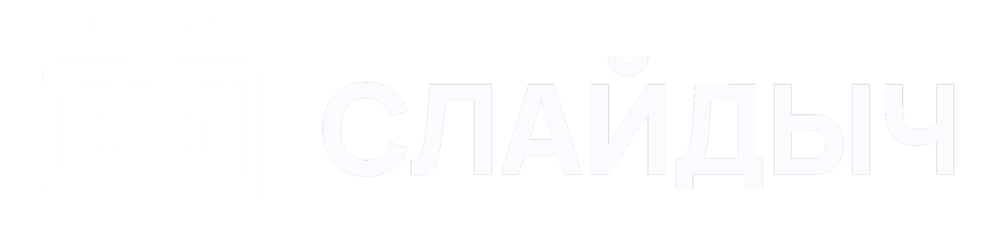
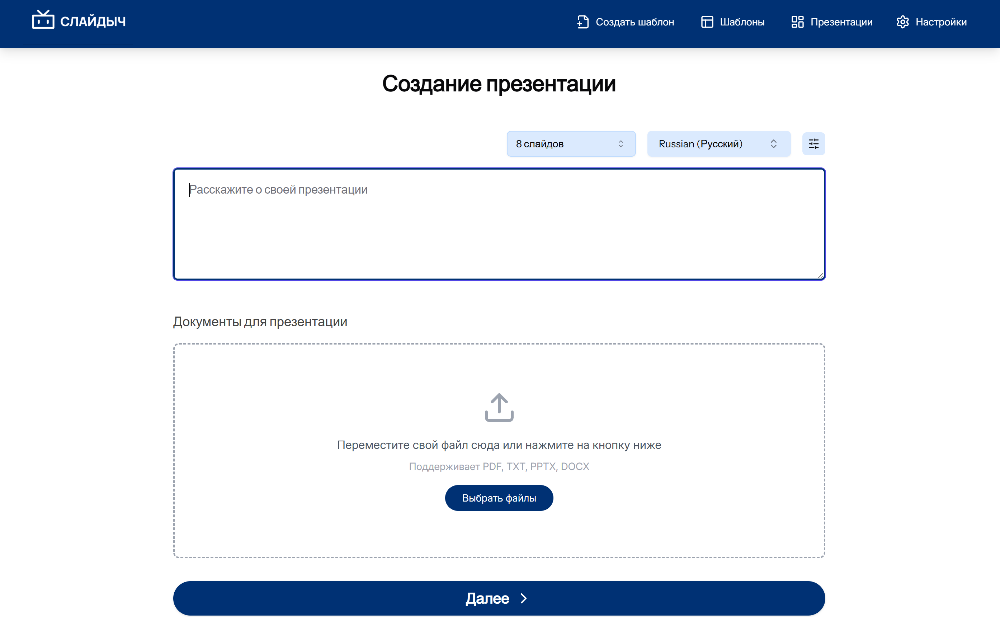
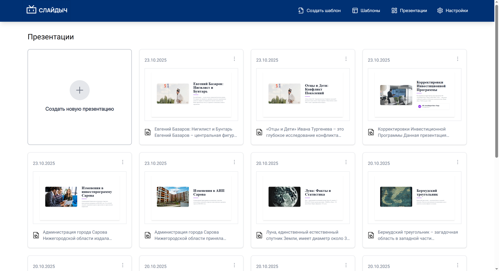
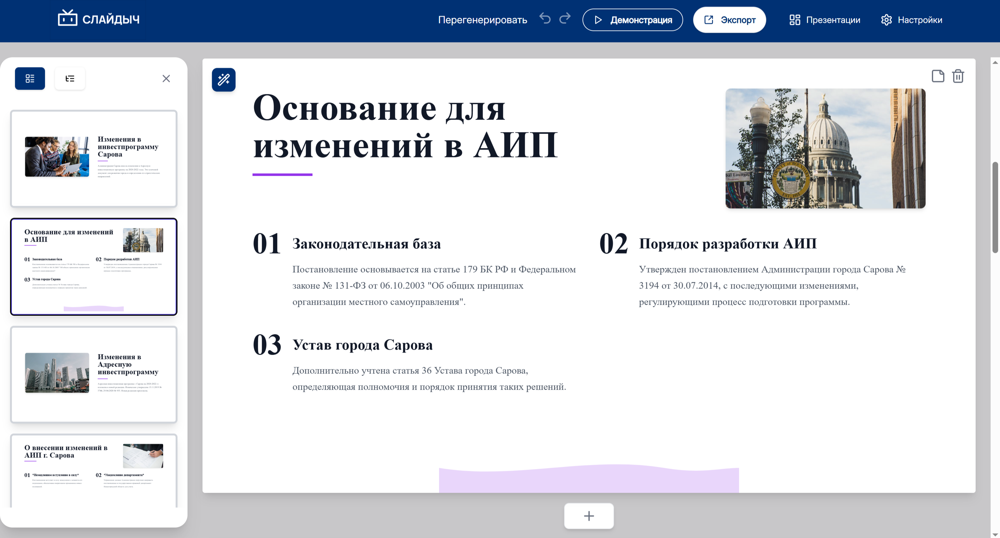
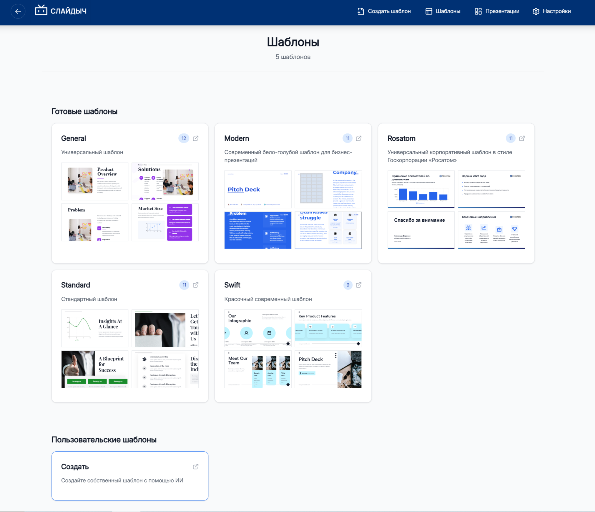

<p align="center">
  
</p>

# Open-Source AI-ассистент для создания презентаций

**Слайдыч** — это умный веб-сервис, который автоматизирует процесс создания презентаций. 
Он позволяет генерировать презентаций на основе пользовательского описания и загруженных документов (PDF, PPTX, TXT, DOCX) - локально на вашем устройстве.  

#### Проект основан на [Presenton](https://github.com/presenton/presenton)  
###  **Доработки и улучшения**

✅ **Новый Image Provider** - добавлена поддержка генерации изображений с помощью Kandinsky  
✅ **RAG-система** - благодаря добавлению Retrieval-Augmented Generation появилась возможность обрабатывать даже объемные документы  
✅ **Улучшенная обработка документов** - парсинг документов оптимизирован и ускорен  
✅ **Локализация** - интерфейс сервиса полностью переведен на русский язык  
✅ **Генерация шаблонов с GOOGLE** - добавлена поддержка моделей GOOGLE для генерации шаблонов  

<center>
    <div style="display: flex; flex-wrap: wrap; justify-content: center; gap: 10px;">
        
        
        
        
    </div>
</center>


## Основные возможности

*   **Поддержка нескольких LLM-провайдеров:** Интеграция с локальными моделями через Ollama и любыми OpenAI-совместимыми API (Gemini, GPT, Claude).
*   **Генерация и подбор изображений:** Поддержка Kandinsky, DALL-E 3, Gemini, а также стоковых сервисов Pexels и Pixabay. Возможность загрузки собственных изображений.
*   **Глубокий анализ документов:** Система использует RAG (Retrieval-Augmented Generation) (langchain) для анализа контента из файлов `.docx`, `.pptx`, `.pdf`, и `.txt`, обеспечивая релевантность генерируемых слайдов.
*   **Создание пользовательских шаблонов:** Загрузите ваш `.pptx` или `.pdf` файл, и Слайдыч сгенерирует на его основе шаблон, который можно использовать для генерации новых презентаций.
*   **Интерактивный редактор слайдов:** Редактируйте текст, заменяйте изображения и иконки, меняйте слайды местами вручную или при помощи ИИ прямо в веб-интерфейсе после генерации.
*   **Экспорт в PPTX и PDF:** Скачивайте готовую презентацию в популярных форматах для дальнейшего использования.


---

## Quick Start

Для запуска проекта на вашем локальном компьютере выполните следующие шаги:

1. **Создайте и настройте файл конфигурации:**
    Скопируйте файл `.env.example` в новый файл `.env` и укажите в нем необходимые ключи API и настройки.
    ```bash
    cp .env.example .env
    ```
    Подробнее о настройке читайте в разделе [Конфигурация](#конфигурация).

<p>&nbsp;</p>

2. **Запустите проект с помощью Docker Compose:**
    ```bash
    docker compose up --build
    ```

После успешного запуска веб-интерфейс будет доступен по адресу `http://localhost:5050`.


---


## Конфигурация

Все настройки проекта производятся в файле `.env`.

### 🧠 НАСТРОЙКИ LLM
| Переменная                            | Описание | Пример |
|:--------------------------------------| :--- | :--- |
| `LLM`                                 | **Обязательно.** Выбор LLM-провайдера. <br> *Варианты: `openai`, `google`, `anthropic`, `ollama`, `custom`* | `"custom"` |
| `CUSTOM_LLM_URL`                      | **(Если `LLM="custom"`).** URL вашего OpenAI-совместимого API. | `"your_custom_api"` |
| `CUSTOM_LLM_API_KEY`                  | **(Если `LLM="custom"`).** API-ключ для вашего API. | `"your_custom_key"` |
| `CUSTOM_MODEL`                        | **(Если `LLM="custom"`).** Название модели (например, `gigachat`). | `"gigachat"` |
| `OPENAI_API_KEY`                      | **(Если `LLM="openai"` или `IMAGE_PROVIDER="dall-e-3"`).** <br> API-ключ от OpenAI. | `"sk-xxxxxxxxxxxxxxxx"` |
| `OPENAI_MODEL`                        | **(Если `LLM="openai"`).** Модель OpenAI (например, `gpt-5`). | `"gpt-5"` |
| `GOOGLE_API_KEY`                      | **(Если `LLM="google"` или `IMAGE_PROVIDER="gemini_flash"`).** <br> API-ключ от Google. | `"AIzaSyXXXXXXXXXXXX"` |
| `GOOGLE_MODEL`                        | **(Если `LLM="google"`).** Модель Google. | `"models/gemini-1.5-pro"` |
| `ANTHROPIC_API_KEY`                   | **(Если `LLM="anthropic"`).** API-ключ от Anthropic. | `"sk-ant-xxxxxxxxxxxx"` |
| `ANTHROPIC_MODEL`                     | **(Если `LLM="anthropic"`).** Модель Anthropic. | `"claude-3-opus-20240229"` |
| `OLLAMA_URL`                          | **(Если `LLM="ollama"`).** URL вашего локального сервера Ollama. | `"http://localhost:11434"` |
| `OLLAMA_MODEL`                        | **(Если `LLM="ollama"`).** Модель Ollama. | `"llama3.2:3b"` |

###  🖼️ НАСТРОЙКИ ПРОВАЙДЕРА ИЗОБРАЖЕНИЙ 
| Переменная                               | Описание                                                                                                                                   | Пример |
|:-----------------------------------------|:-------------------------------------------------------------------------------------------------------------------------------------------| :--- |
| `IMAGE_PROVIDER`                         | **Обязательно.** Выбор провайдера изображений. <br> *AI-модели: `Kandinsky`, `dall-e-3`, `gemini_flash`* <br> *Стоки: `pexels`, `pixabay`* | `"Kandinsky"` |
| `KANDINSKY_API_KEY`                      | **(Если `IMAGE_PROVIDER="Kandinsky"`).** API-ключ от FusionBrain.                                                                          | `"your_kandinsky_api_key"` |
| `KANDINSKY_SECRET_KEY`                   | **(Если `IMAGE_PROVIDER="Kandinsky"`).** Secret-ключ от FusionBrain.                                                                       | `"your_kandinsky_secret_key"` |
| `PEXELS_API_KEY`                         | **(Если `IMAGE_PROVIDER="pexels"`).** API-ключ от Pexels.                                                                                  | `"vzXXXXXXXXXXXXXX"` |
| `PIXABAY_API_KEY`                        | **(Если `IMAGE_PROVIDER="pixabay"`).** API-ключ от Pixabay.                                                                                | `"3883XXXXXXXXXXXXX"` |
| `OPENAI_API_KEY`                         | *(Если `IMAGE_PROVIDER="dall-e-3"`). API-ключ от OpenAI. `OPENAI_API_KEY`*                                                                 | |
| `GOOGLE_API_KEY`                         | *(Если `IMAGE_PROVIDER="gemini_flash"`). API-ключ от GOOGLE. `GOOGLE_API_KEY`*                                                             | |  

### 📁 Хранение данных

По умолчанию все данные (база данных, загруженные файлы, сгенерированные презентации) хранятся в директории `app_data` в корне проекта. Вы можете изменить этот путь, указав его в переменной `APP_DATA_DIRECTORY`.

```env
APP_DATA_DIRECTORY=./app_data
```
